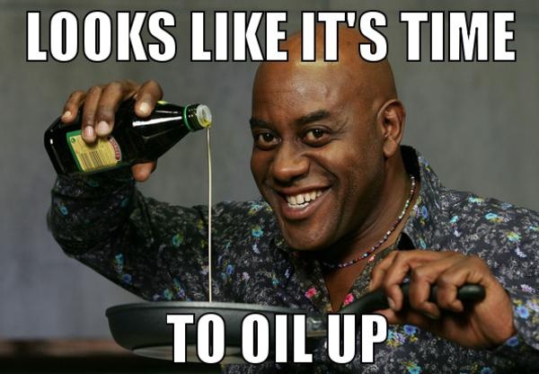

# Authors

Workshop en C# réalisé par Louis Cantinieaux & Thibaut Janssens.

# Theory
[Slides](https://docs.google.com/presentation/d/1jYp38dPLZ4UNBnItOynNL402H8gap3mblmcZNIKusL4/edit?usp=sharing) de la présentation.
Vous pouvez aussi trouver dans le répertoire un document word reprenant une partie de la théorie.

# Environment

Pour developper en C# avec linux, vous pouvez lancer le script `./install.sh` pour télécharger et installer Monodevelop.

Si vous ne pouvez le lancer, faites la commande suivante dans votre terminal :

```cmd
chmod +x ./install.sh
./install.sh
``` 

# Exercises

### Exercise 1

Ask the user to enter three numbers: min, max and current. Display if current is between min and max.

Bonus: if min is greater than max, display an error message to explain the user that he needs to go back to primary school then exit the program.

### Exercise 2

Display all **even** numbers between 1 and 100. 
Do it twice. Once with a while, and the other one with a for.

### Exercise 3

Make a table with different numbers in it.
Then return the sum, the average, the min and the max contained in this table.

### Exercise 4

Choose one version of the 2nd exercise and let's change a bit.
If the number is a multiple of 5, it changes to "Ding Ding".
If it's a multiple of 7, it changes to "Bottle".
If it's a multiple of both, it changes "Ding Ding Bottle".

### Exercise 5

Let's spice it up a little bit 


We'll make a new find the magic number game.
The computer choose a random number between 1-100.
Invite the user to enter a number, and tell him if it's higher or lower than his number.
Bonus: You can add a try catch to avoid that the user enter a string instead of a integer + invite the user to play again.

### Exercise 6

Too easy? Ok let's try this.



We'll make a warrior game. Invite the user to create 3 Warriors.

He will faces random monsters (weak, strong or boss). 
If he kills a weak monster he gains 10 points.
If he kills a strong monster he gains 20 points but he also may drop some potion to heal. Potion heal for 25 hp.
If he kills a boss, he gains 100 points and can revive one warrior if he has a dead one, or he drops 2 potions.
If the warrior dies, the user will use the next warrior he has. If he has none. He loses.
Show the score at the end and invite the user to play again.

The warrior object has several properties such as a name, 100 hp, and a random number between 0-10 hitPoint. (0 he missed, 10 it's a critical hit.)
The weak monster object has 50 hp, a random number between 0-3 hitPoint.
The strong monster has 100 hp, a random number between 0-5 hitPoints.
The boss monster has 150 hp, a random number between 0-7 hitPoints.

 